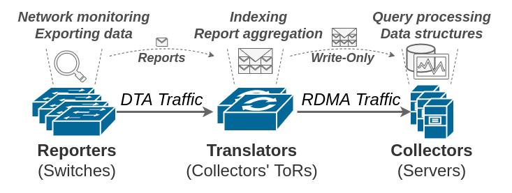
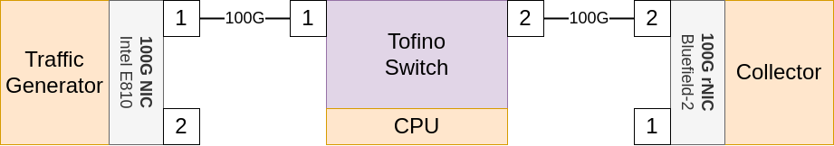

# Direct Telemetry Access (DTA)

This repository contains the code for Direct Telemetry Access.

Direct Telemetry Access is a peer-reviewed system for high-speed telemetry collection presented at ACM SIGCOMM'23.
An open-access version of our paper is available [here](https://arxiv.org/abs/2202.02270).

**The guides in this repository are in an early stage.**

## Overview of Components
DTA is a system consisting of several components, each in their own directories.

### Reporter
[Reporter/](Reporter/) is a DTA reporter switch. 
This switch can generate telemetry reports through DTA.

### Translator
[Translator/](Translator/) is a DTA translator switch. 
This switch will intercept DTA reports and convert these into RDMA traffic. 
It is in charge of establishing and managing RDMA queue-pairs with the collector server.

### Collector
[Collector/](Collector/) contains files for the DTA collector.
This component will reside on the collector server, and will host the in-memory data aggregation structures that the translator will write telemetry reports into.

### Generator
[Generator/](Generator/) contains files for the TReX traffic generator.

### Manager
[Manager/](Manager/) is a set of automation scripts for DTA that handles testbed setup and configuration by connecting to and running commands on the various DTA components.
While the manager is not essential for DTA, it greatly simplifies tests while also indirectly acting as documentation for how to use the DTA system in this repository.

## Requirements
1. A fully installed and functional Tofino switch
2. A server equipped with a RoCEv2-capable RDMA NIC, configured and ready for RDMA workloads
3. Optional: one additional server to act as a traffic generator
4. Cabling between the devices according to the [testbed section](#testbed)

### Testbed
To produce the results from the paper, we had a testbed configured as follows:

## Initial setup
**The initial set up of DTA can be cumbersome.**
Please try to follow these steps best you can, and reach out to me (Jonatan) if the guides prove insufficient.

### RDMA setup on the collector server
A working RDMA environment at the collector-server is essential for DTA.

1. Make sure that your NIC supports RDMA through RoCEv2. We used the NVIDIA Bluefield-2 DPU, and we can not guarantee success with other network cards. However, other RoCEv2-capable network cards where you can disable iCRC verification might work just as well.
2. Install and configure the necessary software and drivers for RDMA workloads, following guides provided by the NIC manufacturer.
3. Verify that the RDMA setup works. This can be done for example by connecting two RDMA-capable NICs together, and using the `ib_send_bw` utility.

### Tofino setup
Our DTA prototype is written for the Tofino-1 ASIC, specifically running SDE version 9.7. Newer SDE versions most likely to work just as well (possibly with minor tweaks to the translator code)

1. Install the SDE and BSP according to official documentation from Intel and the board manufacturer.
2. Verify that you can compile and launch P4 pipelines on the Tofino ASIC, and that you can successfully process network traffic.
3. Modify the translator P4 code to generate RDMA packets with correct MAC addresses for the NIC (function `ControlCraftRDMA` in file [dta_translator.p4](Translator/p4src/dta_translator.p4))
4. **This step could prove difficult.** Modify the initial RDMA packets generated from the Translator CPU to be compatible with your network card (in file [init_rdma_connection.py](Translator/init_rdma_connection.py)), so that is can successfully establish new RDMA connections. I recommend establishing an RDMA connection to the collector NIC through normal means (using another machine) and dumping the first few packets to use as a template on how to establish an RDMA queue-pair. The current packets establish a queue-pair with our specific Mellanox Bluefield-2 DPU.
5. Update `--dir` value in init_rdma_connection.py and `metadata_dir` in switch.py to point to the same directory. This is where the values written into P4 M/A tables will be read from.

### DTA setup
As previously mentioned, DTA consists of several components. You will at a minimum make sure that the translator and collector works

1. Essential: Compile and install the DTA [Translator](Translator/).
2. Essential: Compile and install the DTA [Collector](Collector/).
3. Recommended: Set up the [Generator](Generator/).
4. Recommended: Set up the [Manager](Manager/).
5. Optional: Compile and install the DTA [Reporter](Reporter/).

## Running DTA
Once the DTA testbed is successfully set up, running it is relatively straightforward. We provide a set of automation scripts that could be useful, as well as a brief guide on how to do it manually.

### Using the DTA manager (automated)
The DTA manager automates starting DTA and performing simple tests.
Follow the guide in [Manager/](Manager/).

### Running DTA manually
Basically, you can manually do the tasks that the manager does automatically. If you get stuck, please refer to the manager scripts for hints.
1. Start the [Collector](Collector/)
2. Start the [Translator](Translator/)
3. Replay DTA traffic to the translator (for example using a [traffic generator](Generator/))
4. Analyze and print out the data structures at the collector (you should see how they are populated according to the DTA traffic intercepted by the translator).

## Integrating DTA into your telemetry system
Integrate DTA into your telemetry data flows to benefit from improved collection performance.

You need to update the telemetry-generating devices (reporters) to generate their telemetry reports with DTA headers (see [Reporter/](Reporter/) for an example).
Additionally, you need to update your centralized collector(s) to register the telemetry-storing data structures with RDMA to allow the translator(s) to access these regions (see [Collector/](Collector/) for an example).

It is also possible to craft new DTA primitives to better fit the specifics of your telemetry system. 
This could be a challenging process, but you can use our already implemented primitives as a reference on how to do this.
